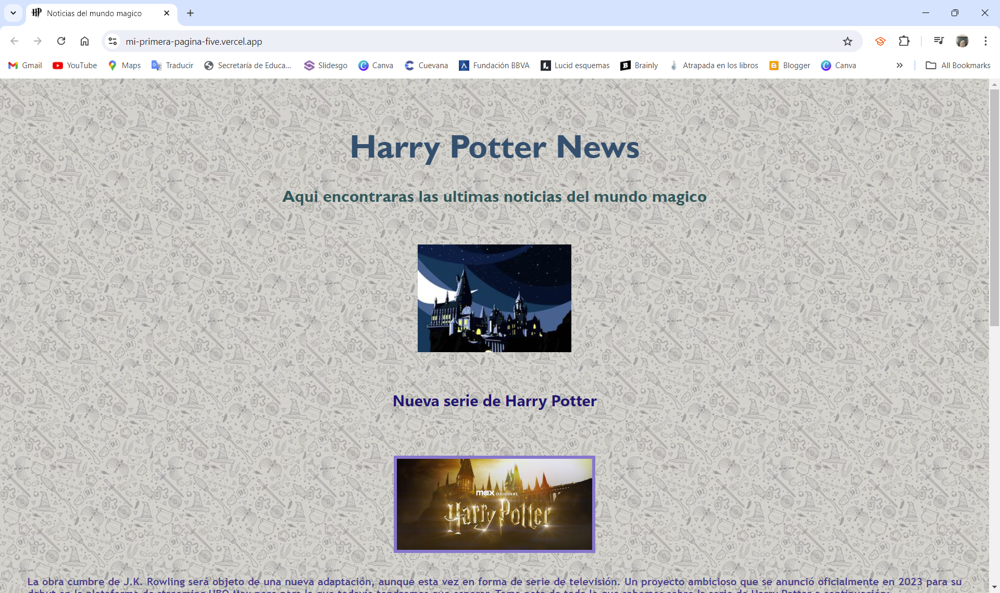
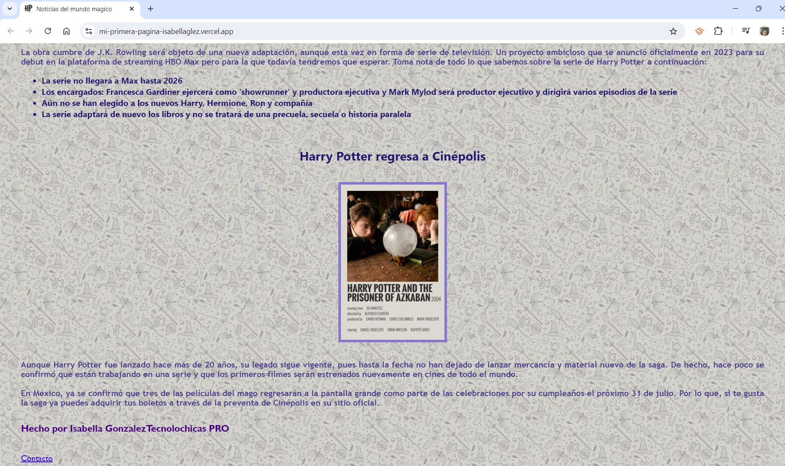
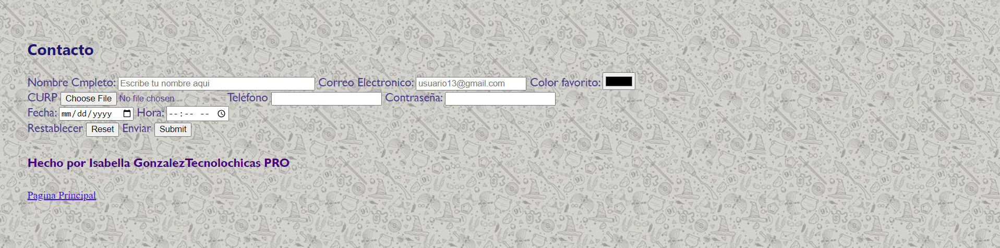

#  Mi Primera Página TECHNOLOCHICAS PRO

El presente proyecto es una pagina sobre un tema relacionado con mis gustos personales, en este caso es de Harry Potter, para poner en práctica las habilidades obtenidad dentro del bootcamp de desarrollo frontend de Technolochicas PRO. 

Fue desarrollado con HTML y CSS. 

La página es responsiva (adaptable a diferentes tamaños de pantalla).

[Proyecto Desplegado](https://mi-primera-pagina-isabellaglez.vercel.app/)

## Secciones de mi Sitio

## Tecnologias
*HTML
*CSS
_ _ _

Desarrollado con 💜 por [Isabella](https://www.instagram.com/isa_glezeli/) en [TECHNOLOCHICAS PRO](https://tecnolochicas.mx/).
